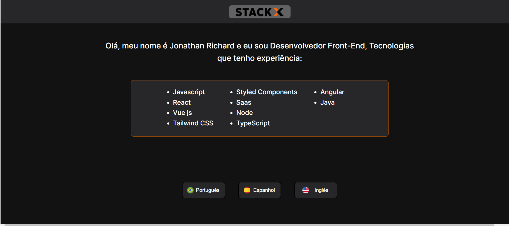

# Desafio Web 3.0 StackX - ReactJs

 

Projeto final do módulo WEB3.0 curso da StackX.

 

 


## Objetivos

 

- Construir um interface gráfica e funcional para interação com o usuário.
- Utilizar os conceitos de componetização do framework.
- Emitir eventos associados ao componente do botão possibilitando a troca de idiomas no conteúdo título da página

 

 

 

## Stack Utilizada

 

**Front-end:**  ReactJs, Styled Components

 

 

## Screenshot

 



 

## Sobre o projeto
 

Este projeto foi gerado com Vite.

 

## Configurando o projeto
```
npm install
```

### Compilar e hot-reloads para ambiente de desenvolvimento
```
npm run dev
```

### Compilar e compactar para produção
```
npm run build
```

### Lints
```
npm run lint
```

### Customizar a configuração
See [Configuration Reference](https://cli.vuejs.org/config/).
